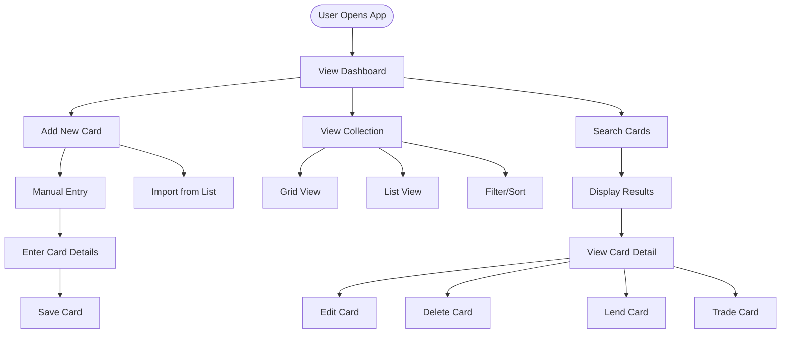
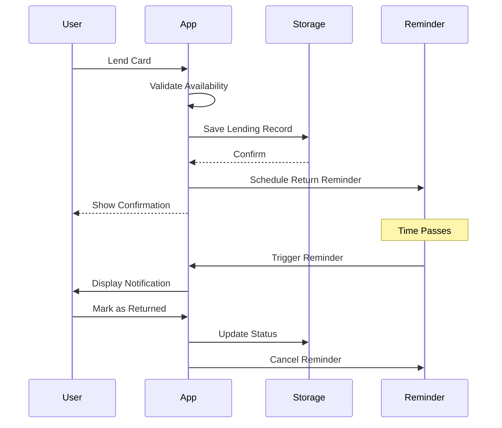
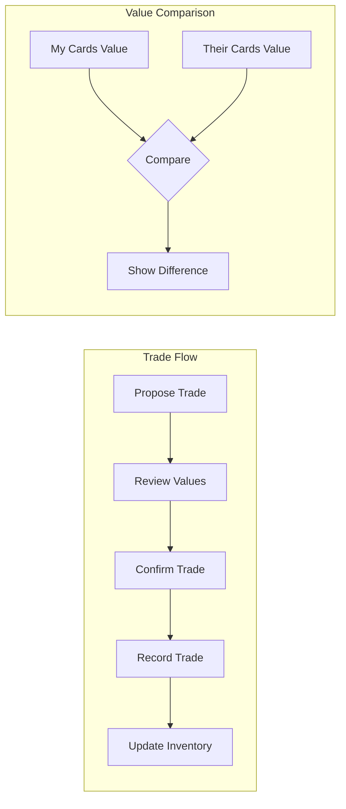
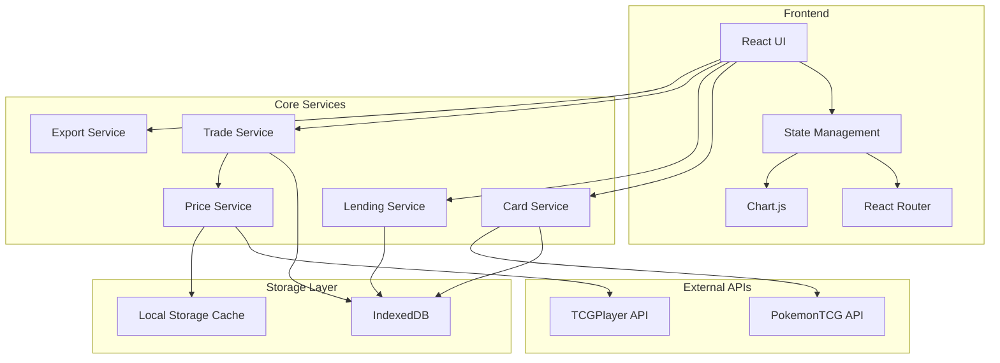
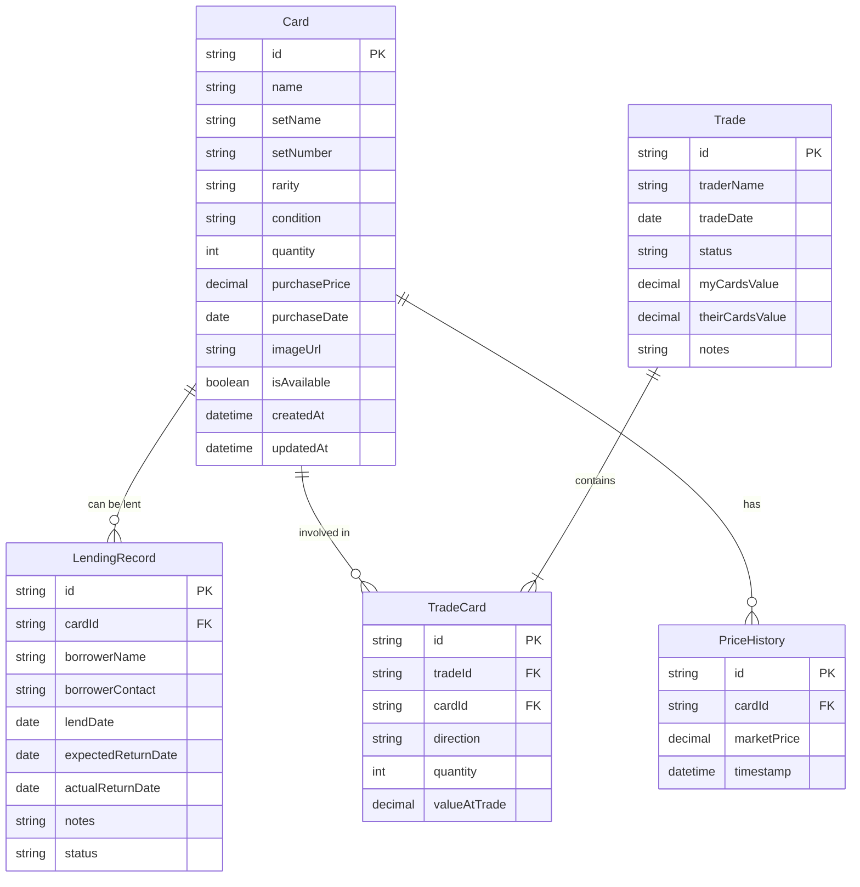

# Pokemon Inventory Manager - Product Requirements Document

## 1. Executive Summary

A personal web application for managing a Pokemon TCG card collection with lending and trading capabilities. The system provides comprehensive inventory tracking, lending management with reminders, trade recording with value comparison, and market price integration. Built as a single-user web application with local storage, optimized for collections of hundreds of cards.

## 2. Problem & Solution

### Problem Statement
Pokemon card collectors lack a simple, personalized tool to:
- Track their card inventory efficiently
- Manage lending of cards to friends with return reminders
- Record trades and compare trade values
- Monitor market prices and collection value
- Export their collection data for backup or sharing

### Solution
A lightweight, browser-based Pokemon inventory manager that:
- Provides intuitive card management with image support
- Tracks lending history with automated reminders
- Records and analyzes trades
- Integrates market pricing data
- Offers comprehensive analytics and export capabilities

## 3. User Stories

### Epic 1: Collection Management



#### Story 1.1: Add Card to Collection
**As a** collector  
**I want** to add new cards to my collection  
**So that** I can track my complete inventory

**Acceptance Criteria:**
- [ ] Manual entry with card name, set, number, condition
- [ ] Auto-complete from Pokemon card database
- [ ] Add quantity for duplicates
- [ ] Upload or link card image
- [ ] Add purchase price and date

#### Story 1.2: Search and Filter Collection
**As a** collector  
**I want** to search and filter my collection  
**So that** I can quickly find specific cards

**Acceptance Criteria:**
- [ ] Search by name, set, type, rarity
- [ ] Filter by availability status (available, lent, traded)
- [ ] Sort by name, value, date added
- [ ] Save frequent searches

### Epic 2: Lending Management



#### Story 2.1: Lend Cards
**As a** collector  
**I want** to track cards I lend to friends  
**So that** I know who has my cards

**Acceptance Criteria:**
- [ ] Select cards to lend
- [ ] Add borrower name and contact
- [ ] Set expected return date
- [ ] Add notes about the loan
- [ ] Prevent lending already lent cards

#### Story 2.2: Return Reminders
**As a** collector  
**I want** to receive reminders about lent cards  
**So that** I can follow up on returns

**Acceptance Criteria:**
- [ ] Browser notifications for due returns
- [ ] Dashboard widget showing overdue items
- [ ] Lending history per borrower
- [ ] Mark cards as returned

### Epic 3: Trade Management



#### Story 3.1: Record Trades
**As a** collector  
**I want** to record my trades  
**So that** I can track my trading history

**Acceptance Criteria:**
- [ ] Select cards given and received
- [ ] Add trader information
- [ ] Compare trade values
- [ ] Mark trade as pending or completed
- [ ] View trade history

### Epic 4: Analytics & Reporting

#### Story 4.1: Collection Statistics
**As a** collector  
**I want** to view statistics about my collection  
**So that** I can understand my collection's composition and value

**Acceptance Criteria:**
- [ ] Total collection value
- [ ] Cards by set, type, rarity
- [ ] Lending statistics
- [ ] Trading profit/loss
- [ ] Collection growth over time

## 4. Technical Architecture



### Technology Stack
- **Frontend**: React with TypeScript
- **State Management**: Zustand or Context API
- **Styling**: Tailwind CSS
- **Database**: IndexedDB with Dexie.js
- **Build Tool**: Vite
- **Charts**: Chart.js or Recharts
- **Export**: jsPDF and Papa Parse

## 5. API Specifications

### External API Integration

#### PokemonTCG API
```typescript
// Get card data
GET https://api.pokemontcg.io/v2/cards?q=name:{cardName}

Response:
{
  "data": [{
    "id": "string",
    "name": "string",
    "set": {
      "name": "string",
      "series": "string"
    },
    "number": "string",
    "rarity": "string",
    "images": {
      "small": "url",
      "large": "url"
    }
  }]
}
```

#### Price Service (TCGPlayer or similar)
```typescript
// Get market price
GET /api/prices/{cardId}

Response:
{
  "cardId": "string",
  "marketPrice": number,
  "lowPrice": number,
  "highPrice": number,
  "updatedAt": "datetime"
}
```

### Internal Service Interfaces

```typescript
interface CardService {
  addCard(card: Card): Promise<Card>
  updateCard(id: string, updates: Partial<Card>): Promise<Card>
  deleteCard(id: string): Promise<void>
  getCards(filters?: CardFilter): Promise<Card[]>
  searchCards(query: string): Promise<Card[]>
}

interface LendingService {
  lendCards(lending: LendingRecord): Promise<LendingRecord>
  returnCards(lendingId: string): Promise<void>
  getLendingHistory(cardId?: string): Promise<LendingRecord[]>
  getOverdueItems(): Promise<LendingRecord[]>
}

interface TradeService {
  recordTrade(trade: Trade): Promise<Trade>
  updateTradeStatus(id: string, status: TradeStatus): Promise<Trade>
  getTradeHistory(): Promise<Trade[]>
  calculateTradeValue(trade: Trade): Promise<TradeValue>
}
```

## 6. Data Models



### State Management Schema

```typescript
interface AppState {
  // Collection State
  cards: Card[]
  selectedCard: Card | null
  filters: CardFilter
  
  // Lending State
  activeLendings: LendingRecord[]
  lendingHistory: LendingRecord[]
  overdueItems: LendingRecord[]
  
  // Trade State
  trades: Trade[]
  pendingTrade: Trade | null
  
  // UI State
  isLoading: boolean
  error: string | null
  notification: Notification | null
  
  // Wishlist
  wishlist: WishlistItem[]
  
  // Statistics
  stats: CollectionStats
}
```

## 7. Implementation Phases

### Phase 1: Core Foundation (MVP)
**Priority: Critical**
- [ ] Project setup with React and TypeScript
- [ ] IndexedDB integration with Dexie.js
- [ ] Basic card CRUD operations
- [ ] Simple card list and grid views
- [ ] Manual card entry form
- [ ] Local storage persistence

### Phase 2: Lending System
**Priority: High**
- [ ] Lending record creation
- [ ] Borrower management
- [ ] Return date tracking
- [ ] Status updates (lent/returned)
- [ ] Basic reminder system
- [ ] Lending history view

### Phase 3: Trade Management
**Priority: High**
- [ ] Trade recording interface
- [ ] Trade history tracking
- [ ] Basic value comparison
- [ ] Trade status management

### Phase 4: External Integration
**Priority: Medium**
- [ ] PokemonTCG API integration
- [ ] Card auto-complete
- [ ] Image fetching
- [ ] Market price integration
- [ ] Price history tracking

### Phase 5: Analytics & Export
**Priority: Medium**
- [ ] Collection statistics
- [ ] Value charts
- [ ] Trading analytics
- [ ] CSV export
- [ ] PDF report generation

### Phase 6: Enhanced Features
**Priority: Low**
- [ ] Wishlist functionality
- [ ] Advanced search filters
- [ ] Bulk operations
- [ ] Data backup/restore
- [ ] Performance optimizations

## 8. Risks & Mitigations

| Risk | Impact | Probability | Mitigation |
|------|--------|-------------|------------|
| API rate limiting | Medium | High | Implement caching layer, batch requests |
| Large dataset performance | High | Medium | Use virtualization, pagination, IndexedDB indexing |
| Data loss (local storage) | High | Low | Regular export reminders, backup functionality |
| Price API changes/deprecation | Medium | Medium | Abstract price service, support multiple providers |
| Browser compatibility | Low | Low | Use modern polyfills, test major browsers |
| Complex trade calculations | Medium | Low | Progressive enhancement, manual override option |

## 9. Success Metrics

### User Engagement
- **Daily Active Usage**: Track app opens per week
- **Cards Added**: Average cards added per session
- **Feature Adoption**: % of features used

### Functionality Metrics
- **Data Accuracy**: Cards with complete information
- **Lending Recovery**: % of lent cards returned on time
- **Trade Balance**: Average trade value difference

### Performance Metrics
- **Load Time**: < 2 seconds initial load
- **Search Speed**: < 500ms for results
- **Export Time**: < 5 seconds for 1000 cards

### Data Quality
- **Price Coverage**: % of cards with market prices
- **Image Coverage**: % of cards with images
- **Missing Data**: Fields commonly left empty

## 10. Appendices

### A. UI Wireframes

```
┌─────────────────────────────────────────┐
│  Pokemon Inventory Manager              │
│ ┌─────────────────────────────────────┐ │
│ │ Dashboard                            │ │
│ │ ┌─────────┐ ┌─────────┐ ┌─────────┐ │ │
│ │ │ Total   │ │ Lent    │ │ Value   │ │ │
│ │ │ 523     │ │ 12      │ │ $2,340  │ │ │
│ │ └─────────┘ └─────────┘ └─────────┘ │ │
│ │                                      │ │
│ │ Recent Activity                      │ │
│ │ • Lent Charizard to John (2 days)   │ │
│ │ • Added 5 new cards                 │ │
│ │ • Trade with Sarah completed        │ │
│ └─────────────────────────────────────┘ │
│                                         │
│ [Collection] [Lending] [Trades] [Stats]│
└─────────────────────────────────────────┘
```

### B. Browser Notification Strategy
- Use Notification API for return reminders
- Check permissions on first lending action
- Store reminder preferences in settings
- Fallback to in-app notifications

### C. Export Format Examples

**CSV Format:**
```csv
Name,Set,Number,Rarity,Condition,Quantity,Value,Status
Charizard,Base Set,4/102,Rare,Near Mint,1,500.00,Available
Pikachu,Jungle,60/64,Common,Played,3,2.50,Lent
```

**PDF Report Structure:**
- Header with collection summary
- Detailed card list with images
- Lending status table
- Trade history
- Collection statistics charts

### D. Development Tools
- **Version Control**: Git
- **Package Manager**: npm/yarn
- **Testing**: Jest + React Testing Library
- **Linting**: ESLint + Prettier
- **Type Checking**: TypeScript strict mode

---

*This PRD is ready for implementation. The modular phase approach allows for iterative development while maintaining a clear vision of the complete system.*